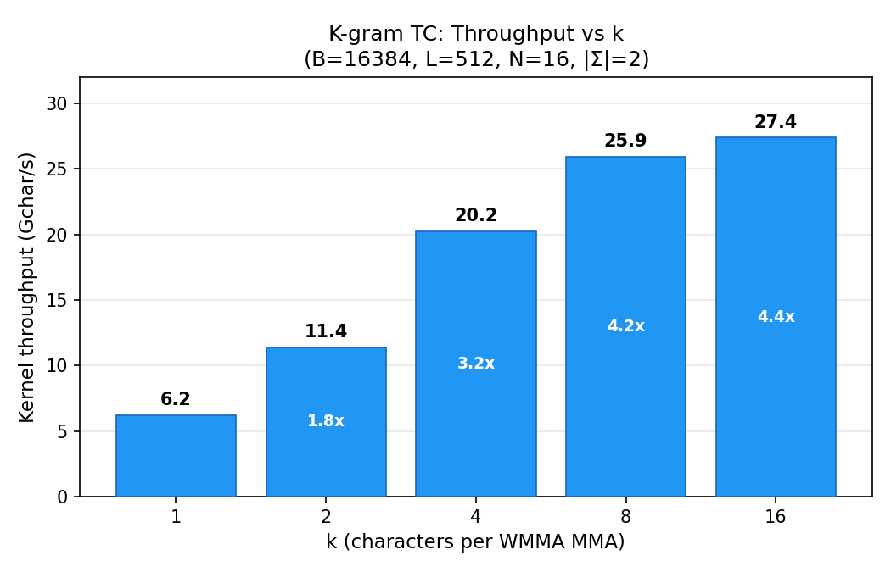
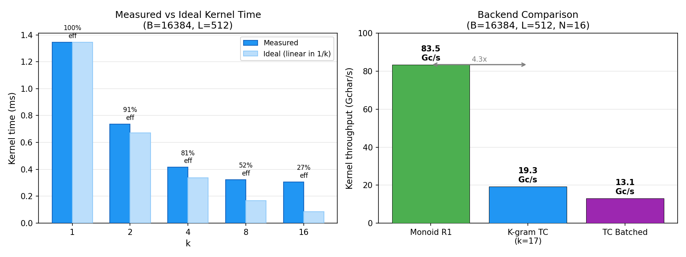
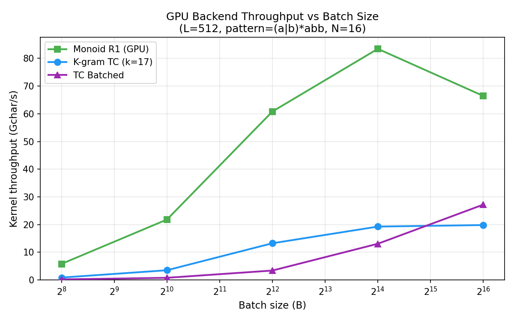
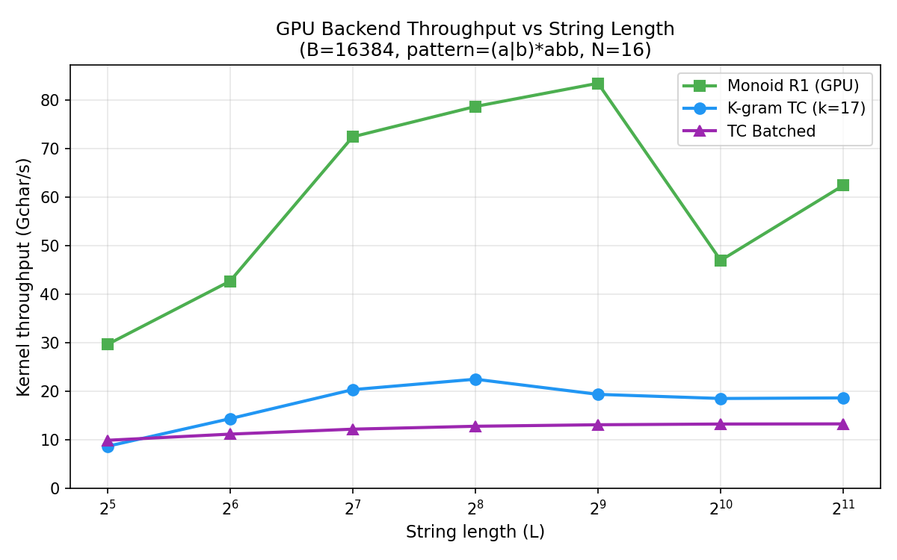
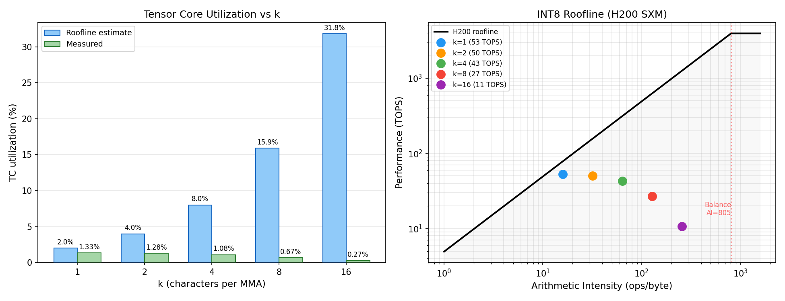

# K-gram Tensor Core Engine: Performance Report

**Date:** 2026-06-18
**Hardware:** NVIDIA H200 NVL (SM 9.0, 132 SMs, 4,917 GB/s peak BW, 3,958 INT8 TOPS)
**Pattern:** `(a|b)*abb` — 4-state DFA, N=16 (padded), |Σ|=2

---

## 1. Motivation

The previous report established that per-character tensor core DFA evolution achieves only 0.53% TC utilization. The serial dependency chain (each MMA depends on the previous result) leaves the tensor cores starved. The monoid optimization side-stepped this entirely by replacing O(N³) matmul with O(1) table lookup, achieving 93 Gc/s — but monoid is only feasible for small DFAs (N ≤ 16, M ≤ ~200).

The k-gram TC engine is designed for the regime where monoid fails: medium-N DFAs (N = 17–64) with small alphabets. It precomputes σ^k product matrices so each WMMA MMA processes k characters instead of 1, multiplying effective arithmetic intensity by k.

This report measures whether k-gram fusion actually delivers on that promise.

---

## 2. K-gram Throughput vs k

Each k value reduces the number of WMMA MMA operations from L to L/k per string. Measured at B=16384, L=512, σ=2, N=16 (each k value benchmarked in a separate CUDA process to avoid allocator interference):

| k | Kernel (Gc/s) | Speedup vs k=1 | Ideal speedup | Efficiency |
|---|--------------|----------------|---------------|------------|
| 1 | 6.2 | 1.0x | 1.0x | 100% |
| 2 | 11.4 | 1.8x | 2.0x | 91% |
| 4 | 20.2 | 3.2x | 4.0x | 81% |
| 8 | 25.9 | 4.2x | 8.0x | 52% |
| 16 | 27.4 | 4.4x | 16.0x | 27% |



**Diminishing returns are severe.** Going from k=1 to k=2 captures 91% of the ideal 2x speedup, but k=16 captures only 27% of the ideal 16x. The speedup asymptotes around 4.5x because the non-MMA overhead — shared memory store, thresholding, fragment reload, and k-gram table lookup from global memory — becomes the dominant cost as the number of MMA operations shrinks.



The left panel shows this directly: at k=16, the ideal kernel time (if MMA were the only cost) would be 0.084 ms, but the measured time is 0.306 ms. The gap (0.222 ms) is the fixed per-iteration overhead that does not scale with k.

---

## 3. Backend Comparison

### 3.1 Throughput vs Batch Size (L=512)

| B | Monoid R1 (Gc/s) | K-gram TC k=17 (Gc/s) | TC Batched (Gc/s) |
|------|-----------|-----------|-----------|
| 256 | 5.8 | 0.9 | 0.2 |
| 1,024 | 21.8 | 3.5 | 0.8 |
| 4,096 | 60.8 | 13.3 | 3.4 |
| 16,384 | 83.5 | 19.3 | 13.1 |
| 65,536 | 66.5 | 19.8 | 27.2 |



**Key observations:**

1. **Monoid dominates at N=16**, peaking at 83.5 Gc/s — 4.3x faster than k-gram TC. This is expected: monoid replaces the entire matmul with an O(1) table lookup. No amount of k-gram fusion can close this gap.

2. **K-gram TC plateaus at ~20 Gc/s** beyond B=16384. The kernel is occupancy-limited: each warp processes one string, so only 4 strings per block (vs 16 per warp for the batched kernel). At B=65536 with 4 strings/block, we launch 16384 blocks — enough to saturate the GPU, but each block does relatively little work.

3. **TC Batched scales further at large B** (27.2 Gc/s at B=65536) because it processes 16 strings per warp, giving better SM utilization at high batch sizes. However, it is slower at moderate B because its "select-by-threshold" approach (compute ALL σ candidates per position, then select) wastes work when σ is small.

4. **K-gram TC beats TC Batched for B ≤ 16384** — the crossover is at B ≈ 32K. K-gram's advantage at moderate B comes from doing fewer global memory loads (1 table lookup per k chars vs σ loads per char for batched).

### 3.2 Throughput vs String Length (B=16384)

| L | Monoid R1 (Gc/s) | K-gram TC (Gc/s) | TC Batched (Gc/s) |
|------|-----------|-----------|-----------|
| 32 | 29.7 | 8.7 | 9.9 |
| 64 | 42.7 | 14.4 | 11.2 |
| 128 | 72.4 | 20.4 | 12.2 |
| 256 | 78.7 | 22.5 | 12.8 |
| 512 | 83.5 | 19.4 | 13.1 |
| 1,024 | 47.0 | 18.5 | 13.3 |
| 2,048 | 62.4 | 18.7 | 13.3 |



**K-gram peaks at L=256** (22.5 Gc/s) then stabilizes around 19 Gc/s. At short strings (L=32), the kernel launch overhead and per-string initialization cost limit throughput. At long strings (L ≥ 512), the k-gram table lookup latency becomes the bottleneck — each MMA iteration must load a 256-byte matrix from a 32MB table (2^17 entries for k=17), causing L2 cache pressure.

**TC Batched is length-independent** at ~13 Gc/s, reflecting its fully pipelined design — string length only changes the number of loop iterations, not the per-iteration cost.

---

## 4. Tensor Core Utilization

### 4.1 The Roofline Gap

The roofline model predicts that k-gram fusion should increase effective arithmetic intensity by k, proportionally increasing TC utilization. Measured results tell a different story:

| k | Effective AI (ops/byte) | Roofline TC util | Measured TOPS | Measured TC util |
|---|------------------------|-----------------|---------------|-----------------|
| 1 | 16 | 2.0% | 52.6 | 1.33% |
| 2 | 32 | 4.0% | 50.5 | 1.28% |
| 4 | 64 | 8.0% | 42.6 | 1.08% |
| 8 | 128 | 15.9% | 26.7 | 0.67% |
| 16 | 256 | 31.8% | 10.7 | 0.27% |



**Measured TC utilization *decreases* with k** — the opposite of the roofline prediction. The explanation: the roofline model assumes the kernel is compute-bound, but this kernel is **latency-bound**. Each WMMA MMA depends on the previous result (serial chain), and the per-iteration overhead (table lookup, shared memory round-trip, threshold) grows relative to the MMA cost as k increases.

### 4.2 Why Actual TOPS Decreases

At k=1, the kernel performs 512 MMAs per string. At k=16, it performs 32 MMAs. The tensor cores do less total work with larger k (by design — that's the whole point of fusion). But TOPS measures *compute rate*, not *useful work per second*.

The measured TOPS drops because the time between consecutive MMAs grows: at k=16, each MMA must wait for a table lookup into a 16MB table (vs 512 bytes at k=1). The tensor cores execute fewer operations per second even though each operation "counts for more."

### 4.3 What This Means

The roofline model is misleading for this workload. DFA state evolution has a fundamentally serial dependency chain — each step depends on the previous result. K-gram fusion reduces the number of serial steps, which directly reduces wall-clock time (4.4x speedup), but it cannot increase the *rate* at which tensor cores fire because the bottleneck is not arithmetic intensity — it's the latency of the read → MMA → store → threshold → read cycle.

**TC utilization is the wrong metric for serial-chain kernels.** The right metric is wall-clock throughput (Gchar/s), and by that measure, k-gram fusion delivers a meaningful 4.4x improvement.

---

## 5. Where K-gram TC Fits

### The Backend Hierarchy

| Regime | Best backend | Throughput | Why |
|--------|-------------|------------|-----|
| N ≤ 16, small monoid | Monoid R1 | 83 Gc/s | O(1) lookup replaces O(N³) matmul |
| N = 17–64, small σ | **K-gram TC** | **~20 Gc/s** | **k-gram fusion amortizes MMA cost** |
| N = 17–64, large σ | TC Batched | ~13 Gc/s | σ^k table too large for L2 |
| N > 64 | TC Batched or CPU | varies | Multi-tile needed |

K-gram TC's value proposition is for **medium-N DFAs (17–64 states) with small alphabets** — the regime where monoid is infeasible (M ≤ N! explodes) but the k-gram table (σ^k × N²) still fits in L2 cache.

For N=16 specifically, the monoid approach is 4.3x faster and should always be preferred. The benchmarks in this report use N=16 only because the current kernel supports single-tile WMMA. The true test of k-gram TC will come with a multi-tile kernel for N > 16.

### Auto-selection Logic

```
auto_k_for_gpu(sigma, N, max_table_bytes=48MB):
    k = max k such that sigma^k × N² ≤ max_table_bytes
```

For binary alphabet (σ=2), N=16: k=17 (2^17 × 256 = 32MB).
For byte alphabet (σ=256), N=16: k=1 (256 × 256 = 64KB) — k-gram adds no value, falls back to batched TC.

---

## 6. Summary

**What works:**
- K-gram fusion delivers a genuine 4.4x kernel speedup (6.2 → 27.4 Gc/s) by reducing the number of serial MMA operations
- The kernel produces correct results across all tested patterns, k values, and string lengths
- auto_k_for_gpu correctly selects the largest k that fits the L2 cache budget

**What doesn't:**
- TC utilization does not improve with k-gram fusion — the bottleneck is serial dependency latency, not arithmetic intensity
- Diminishing returns beyond k=4: the last 4x of k-range (k=4 → k=16) yields only 1.35x speedup
- For N=16, monoid R1 is 4.3x faster — k-gram TC only makes sense when monoid is infeasible

**The fundamental insight:** K-gram fusion correctly reduces the number of serial steps in the dependency chain, which reduces wall-clock time. But it cannot transform a latency-bound serial kernel into a throughput-bound parallel kernel — the tensor cores will never be fully utilized for this workload at any k. The path to high TC utilization requires either breaking the serial dependency (parallel prefix scan, but with O(log L) depth) or increasing N until each MMA does enough work to amortize the pipeline latency (N ≈ 1200 for 100% utilization on H200).
